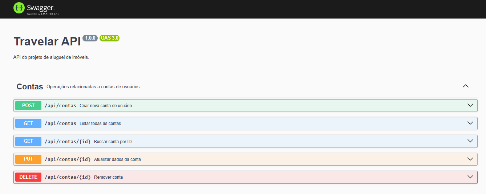

# Travelar Backend

Este repositório contém o backend do projeto Travelar, uma API REST para gerenciamento de contas e funcionalidades relacionadas a um sistema de aluguéis de imóveis por temporada.
## Tecnologias

- Node.js
- TypeScript
- Express.js
- PostgreSQL
- TypeORM
- Docker & Docker Compose
- Swagger/OpenAPI

## Visão geral da arquitetura

```plaintext
Travelar-Backend/
├── src/
│   ├── Contas/
│   │   ├── controller.ts
│   │   ├── entity.ts
│   │   ├── routes.ts
│   │   └── service.ts
│   ├── database/
│   │   └── data-source.ts
│   ├── app.ts
│   └── server.ts
├── .env.example
├── .gitignore
├── docker-compose.yml
├── Dockerfile
├── package.json
├── README.md
├── swagger.config.js
└── tsconfig.json
```

## Estrutura de endpoints (resumo)

- POST /api/contas        — Criar uma nova conta
- GET  /api/contas        — Listar todas as contas
- GET  /api/contas/:id    — Buscar conta por id
- PUT  /api/contas/:id    — Atualizar conta
- DELETE /api/contas/:id  — Remover conta

A documentação completa está disponível via Swagger.

## Preparar o ambiente (pré-requisitos)

- Git
- Node.js 18.x (recomendo usar nvm ou nvm-windows)
- Docker & Docker Compose (opcional, para rodar DB e app com um único comando)

## Clonar o repositório

1. Clone o repositório:

```bash
git clone https://github.com/Travelar-Spot/Travelar-backend.git
cd Travelar-backend
```

2. Copie o arquivo de exemplo de ambiente e ajuste conforme necessário:

```bash
copy .env.example .env    # Windows PowerShell
# ou
cp .env.example .env      # macOS / Linux
```

Edite `.env` com as credenciais do banco de dados se precisar.

## Executando localmente (modo desenvolvimento)

1. Instale dependências:

```bash
npm ci
```

2. Inicie o banco de dados (local) ou via Docker Compose:

- Usando Docker Compose (inicia Postgres + pgAdmin):

```bash
docker compose up -d
```

- Ou garanta que o PostgreSQL esteja rodando e as credenciais em `.env` batam com a sua instância.

3. Inicie a aplicação em modo desenvolvimento:

```bash
npm run dev
```

A aplicação deve iniciar e expor a API na porta configurada no `.env` (por padrão 3000 se não alterado).

## Executando com Docker (recomendado para clonagem fácil)

O repositório já contém `Dockerfile` e `docker-compose.yml`. Para iniciar tudo com um comando:

```bash
docker compose up --build -d
```

Isso criará/rodará os serviços (aplicação, banco de dados, pgAdmin). Verifique os logs:

```bash
docker compose logs -f app
```

## Configuração do banco (TypeORM)

- O arquivo `src/database/data-source.ts` contém a configuração principal do TypeORM.
- As entidades (ex.: `ContaUsuario`) estão em `src/Contas/entidade.ts`.
- Se estiver usando Docker Compose, os valores do `.env` criados pelo `docker-compose.yml` serão usados.

## Testando o Swagger (documentação da API)

Após iniciar a aplicação, a documentação Swagger estará disponível em:

```
http://localhost:3000/api-docs
```




Passos para testar:
1. Abra o navegador e navegue até `/api-docs`.
2. Explore os endpoints disponibilizados (POST/GET/PUT/DELETE para /api/contas).
3. Use o Swagger UI para enviar requisições de teste diretamente (preencha bodies e parâmetros conforme especificado).

## Lint e formatação

- Prettier está configurado e há scripts npm:
  - `npm run lint` — verifica formatação (Prettier)
  - `npm run lint:fix` — aplica formatação

- ESLint está preparado no repositório e o workflow de CI foi atualizado para rodar ESLint em PRs. Para rodar localmente:

```bash
npm run lint:eslint
npm run lint:eslint:fix
```

